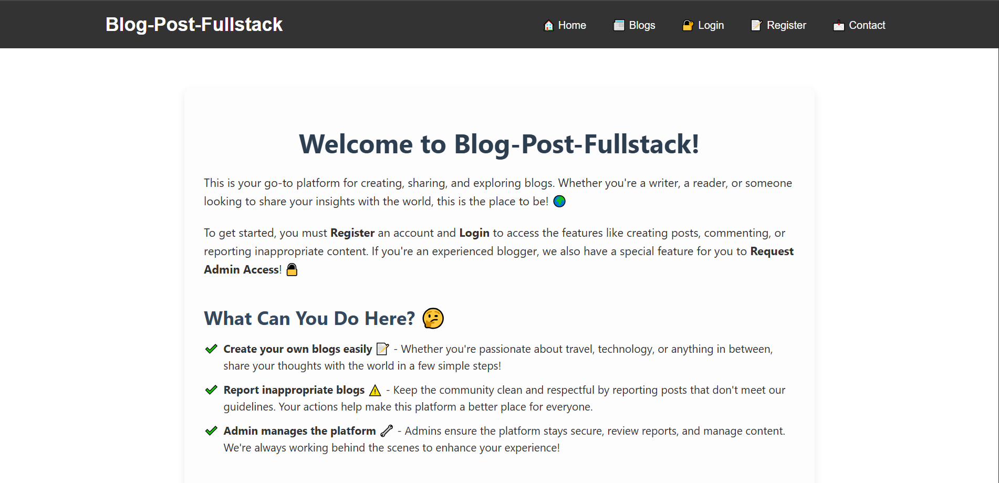
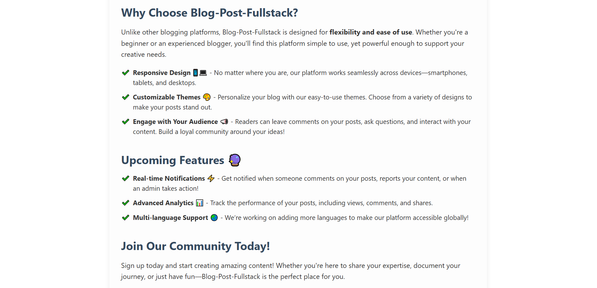
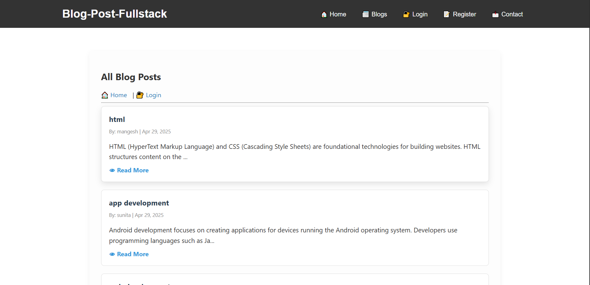
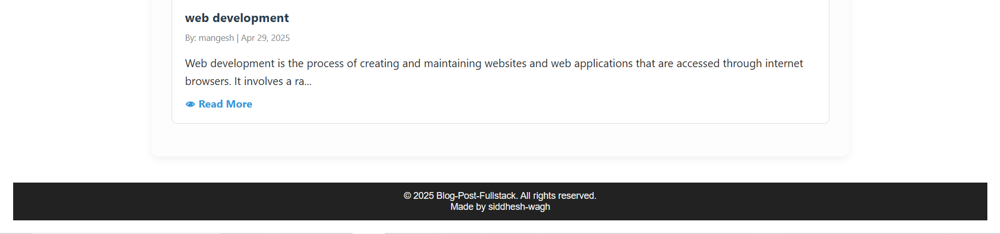
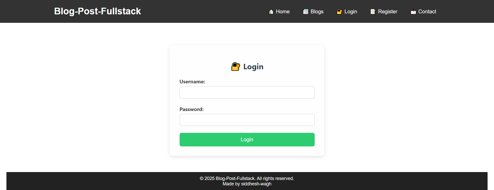
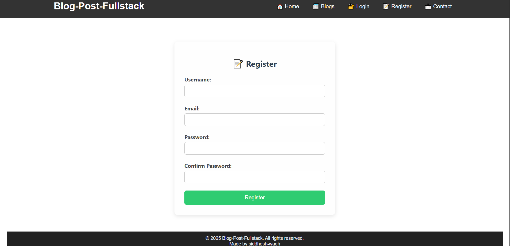
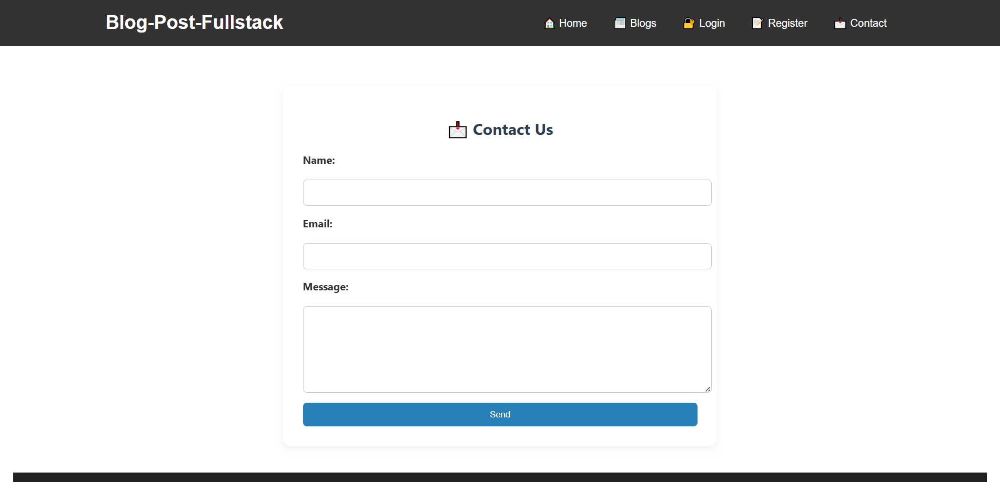
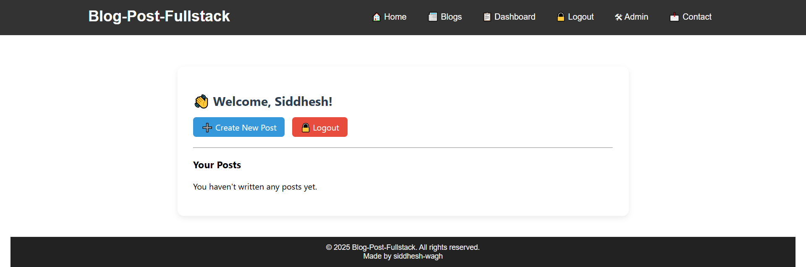
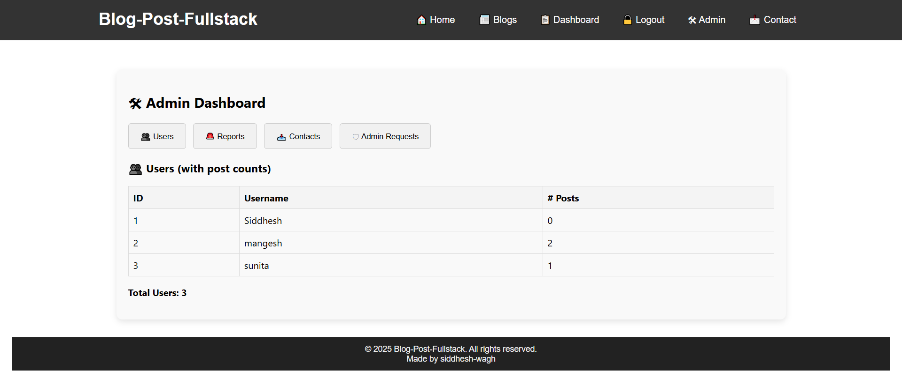

# 📝 Blog Post Fullstack Application

A feature-rich blog platform built with **Core PHP** and **MySQL**, supporting user authentication, role-based access control, post creation, reporting system, and a full admin panel.

---

## 🚀 Features

* ✨ **User registration & secure login**
* 🛡️ **Password hashing (bcrypt)**
* 📝 **Create, Read, Update, Delete (CRUD) blog posts**
* 🚨 **Report inappropriate posts**
* 🧑‍💼 **Admin dashboard for post & user management**
* 📬 **Contact form with message logging**
* 🔁 **Admin role request & approval flow**
* 📱 **Fully responsive design with Bootstrap**

---

## 🛠️ Tech Stack

### 💻 Frontend

* **HTML5** – Structure via `.php` templates
* **CSS3** – Custom styling (`style.css`)
* **JavaScript** – Client-side interactions
* **Bootstrap 5** – Responsive UI components (via CDN)

### 🖥️ Backend

* **PHP (Core PHP)** – No frameworks, lightweight and flexible
* **MySQL / MariaDB** – RDBMS used for persistent storage

### 🗃️ Database

**Database Name**: `blog_post_fullstack`

Core Tables:

* `users` – Stores login data, roles, and admin request status
* `posts` – Blog content authored by users
* `reports` – Reports logged for offensive or irrelevant posts
* `contacts` – Submissions from the contact form

---

## 📁 Folder Structure

```plaintext
blog_post_fullstack/
├── css/
│   └── style.css               # Main stylesheet
├── js/
│   └── script.js               # Optional JS functionality
├── includes/
│   ├── db.php                  # Database connection logic
│   ├── header.php              # Common header (nav, meta)
│   ├── footer.php              # Common footer
│   └── auth.php                # Session-based access control
├── pages/
│   ├── index.php               # Homepage with post listings
│   ├── blog.php                # Blog view or listing
│   ├── contact.php             # Contact form
│   ├── dashboard.php           # User panel to manage posts
│   ├── add_post.php            # Form to create a new post
│   ├── view_post.php           # Detailed view of single post
│   ├── login.php               # Login form
│   ├── register.php            # Registration form
│   └── admin.php               # Admin control panel
├── sql/
│   └── blog_post_fullstack.sql # SQL dump with structure & data
├── uploads/
│   └── (optional)              # Directory for post-related files
├── README.md                   # You're reading it!
└── .htaccess                   # Optional: clean URLs, security
```

## 📸 Screenshots

Here are some preview screenshots of the blog application:

### 🏠 Home Page




### 📖 Blog



### 🔐 Authentication



### 📬 Contact Page


### 🧑‍💼 User Dashboard


### 🛠️ Admin Panel



---


---

## ⚙️ Setup Instructions

Sure! Here's the full **`SETUP.md`** content you can copy into a `.md` file (like `SETUP.md` or directly into your `README.md` under the **Setup Instructions** section):

---

## ⚙️ Setup Instructions

> ⚠️ **Important:** Before running the application, it's strongly recommended to **reset/clear any existing data** in the database and create **your own admin/user accounts and posts** for a clean setup. This ensures there’s no leftover or test data from previous installations.

---

### 1. Clone or Download the Project

Download or clone this repository into your local server directory (e.g., `htdocs/` if using XAMPP).

```bash
git clone https://github.com/siddhesh-wagh/blog_app_fullstack.git
````

Or simply download the ZIP and extract it into `htdocs/`.

---

### 2. Import the Database

1. Open **phpMyAdmin**

2. Create a new database named:

   ```
   blog_post_fullstack
   ```

3. Import the SQL file located at:

   ```
   sql/blog_post_fullstack.sql
   ```

---

### 3. Configure Database Connection

In `includes/db.php`, update the database credentials as per your environment:

```php
$conn = new mysqli('localhost', 'root', '', 'blog_post_fullstack');
```

---

### 4. (Optional but Recommended) Clean Slate Setup

To ensure you're starting fresh with your own data:

1. In **phpMyAdmin**, run the following SQL commands to **truncate** tables:

```sql
TRUNCATE TABLE users;
TRUNCATE TABLE posts;
TRUNCATE TABLE reports;
TRUNCATE TABLE contacts;
```

2. Register new users through the front-end.
3. Manually assign admin roles in the `users` table if needed by setting the `role` column to `'admin'`.

---

### 5. Run the Application

Start **Apache** and **MySQL** in XAMPP and open the browser at:

```
http://localhost/blog_post_fullstack/pages/index.php
```

---

### 6. Admin Access (Optional for Testing)

A default admin account is available for quick access (only if imported with the original SQL file):

> ✅ You are now ready to explore, modify, and enhance your blog platform!


## 🔒 Security

✅ Passwords stored securely via **bcrypt hashing**
✅ Admin routes protected via session middleware
✅ Actions gated by **role-based access control**

---


## 📬 Contact

For questions, feedback, or collaboration inquiries, feel free to reach out:
📧 **Email:** [siddhesh.01092004@gmail.com](mailto:siddhesh.01092004@gmail.com)

---

> Crafted with ❤️ by [**Siddhesh Wagh**](https://siddhesh-wagh.github.io/portfolio/) using Core PHP and MySQL

---

